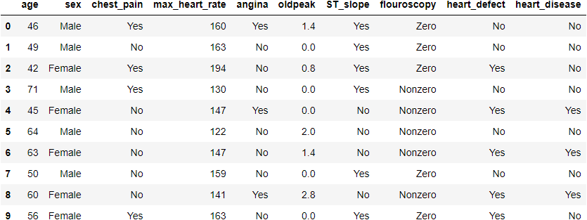
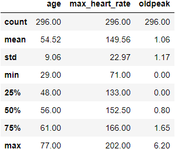
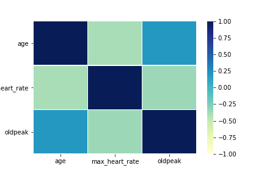
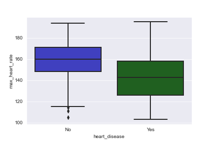

# heart-disease-prediction

This notebook predicts the presence or absence of heart disease based on medical and demographic features. It uses data from https://www.kaggle.com/ronitf/heart-disease-uci, which was published by researchers in de-identified form. There are 296 cases total, of which 136 indicate heart disease.

The notebook was built with Python 3.8.10. The YAML file lists the required packages and may be used to create a conda environment with these packages: see `RUNNING_THE_MODEL` for details.

For questions or comments, please contact me at dvschwab@protonmail.com.

## Summary

The notebook fits 3 versions of a logistic regression model:
> * a full model with all cases and features
> * a reduced model containing only the 9 features with the greatest predictive value
> * a reduced model with 20 outliers trimmed.

All perform well, with a median accuracy of 83% for the test data. None of the models are prone to false positives, although each is slightly better at predicting the absence of heart disease than its presence. However, the cross-validation scores show sample dependence for each model, as shown below for the reduced model:

> ##### Cross-Validation (5 splits)  
> Test Accuracy: [0.75, 0.83, 0.90, 0.90, 0.86]  

All results are for the test data. *Accuracy* is the total accuracy for both targets. The sample dependence is clear from the first, third, and fourth splits.

The relatively small number of cases per model feature is another limitation. For the reduced model containing 9 features and using a 30/70 test-train split, this amounts to 89 cases / 9 features = 10 cases per feature (standard rounding). Most researchers consider this the minimum ratio of cases-to-feature, as the coefficient standard errors will likely be too large to evaluate the relative importance of each feature.

## Feature Descriptions

For clarity, only the reduced model with 9 predictors is described from this point on. Full descriptions of all three models are available in the main notebook `heart-disease-prediction-data-analysis.ipynb`.

These are the demographic and numeric (i.e. continuous) features used in the model:

> * age: age of subject
> * sex: sex of subject (Male/Female)
> * max_heart_rate: maximum heart rate
> * oldpeak: ST depression from exercise

These are the categorical features. Each one indicates the presence of the named indicator, except for *flouroscopy*, which indicates how many major vessels were colored by a specific flouroscopic test (Zero or Nonzero). In all cases, Yes indicates an abnormal condition while No indicates normal functioning.

> * chest_pain: chest pain (Yes/No)
> * angina: exercise-induced angina (Yes/No)
> * ST_slope: abnormal ST slope (Yes/No)
> * flouroscopy: number of vessels colored by flouroscopy (Zero/Nonzero)
> * heart_defect: heart defect (Yes/No)

The target variable, *heart_disease*, is coded *Yes* or *No*. The data for the model presented here has 160 cases without heart disease and 136 with heart disease, totalling 296 cases in all.

## Representative Data Sample

This is a representative sample of 10 cases from the data frame used to fit the reduced model. The categorical features have been replaced with text to make them more understandable.



## Descriptive Statistics

These are three descriptive statistics estimated for the model. The first figure presents summary statistics for the three numeric features. The remaining figures present a heatmap of the cross-correlations between these features and a representative boxplot comparing the presence of heart disease vs. the maximum heart rate.

### Summary of Numeric Features


Summary statistics for the numeric variables are unexceptional. This may be due to the fact that the features are well-established medical measurement that are known to be at least approximately normal for large samples.



### Correlation of Numeric Features

The correlation between the three numeric features in the reduced model is shown here as a heatmap. As with a traditional correlation matrix, the diagonal elements show each feature's correlation with itself and are therefore unimportant. The remaining elements show the cross-correlation between the row feature and the column feature: for example, the element at the upper right is the correlation between the features *age* and *oldpeak*

The scale on the right-hand side ranges from perfect positive correlation (at the top) to perfect negative correlation (at the bottom). As can be seen, blue elements show positive correlation and green elements show negative correlation; in both cases, darker colors indicate a stronger correlation.

Here, we se a small positive correlation between the features *age* and *old_peak* (approx. 0.25) and a small negative correlation between the remaining two features (approx. -.025). Since these features are included in the model, the presence of small correlations is desirable so that the effect of each feature on the target is relatively independent.



### Boxplot of Maximum Heart Rate vs. Heart Disease

This boxplot shows the relationship between the feature *max_heart_rate* and the target. It is representative of the relationships between each numeric feature and the target. Note that the 20 outliers have been excluded from the plot to aid in readability.

As can be seen, patients with heart disease have a relatively lower maximum heart rate: the median value is approximately 20 beats less for patients with heart disease. This indicates the feature may be a good predictor of heart disease.



## Model Estimation and Results

The following section shows the code blocks that define and estimate the model. Following that, it presents the model results.

### Model Estimation

The model was estimated using the `LogisticRegression` method from the `sklearn` package. Because three models in total were estimated--a full model with all 13 features, the reduced model with 9 features presented here, and a reduced model with outliers excluded--each model was defined with a dictionary and all the models were estimated consecutively in a loop. This design pattern makes it easy to see the parameters of each model, and it can also be modified or extended if additional models are desired.

#### Global Parameters and Model Features

The following code excerpt defines the global parameters (i.e. the ones applying to all three models) and the parameters for the reduced model. Note that the complete notebook includes the parameters for the additional models as well.

```python
# Configure estimator parameters and define model features

params = {
    'test_size': 0.3,
    'random_state': 823,
    'metrics': ['accuracy'],
    'cv_splits': 5
}

model_reduced = {
    'model_name': 'clf_reduced',
    'columns': ["age", "sex", "chest_pain", "max_heart_rate", "angina", "oldpeak", "ST_slope", "flouroscopy", "heart_defect", "outlier"],
    'keep_outliers': True
}
```

Having defined the parameters, the following code excerpts estimates each model using a loop.

#### Configure Estimator

First, the estimator is configured and set to run for 1,000 iterations to ensure convergence. A list of all models is also created to be iterated over in the loop.

```python
models = [model_full, model_reduced, model_trimmed]
clf = LogisticRegression(max_iter=1000)
df = df_heart_scaled.copy()
model_coef = collections.OrderedDict()            
```

#### Main Loop: Handling Outliers

After the estimator has been configured, the main execution loop beings. The first section excludes outliers if the model parameter *keep_outliers* is True.

```python
for model in models:
    
    # Keep or exclude outliers
    
    if (model['keep_outliers']):
        pass
    else:
        df = df[df.outlier == False]
    
    # Outlier column no longer needed, and will interfere with coef_df, below
    
    model['columns'].remove('outlier')
```

#### Main Loop: Model Estimation and Fit

Next, the features and target vectors are defined as *X* and *y*. After that, a 70/30 test-train split is performed and the logistic regression fit using the training data. The number of cases, training score, and testing score are then added to the model dictionary for later use.

```python
    # Define the model

    clf_cols = model['columns']
    X = df[clf_cols]
    y = df["heart_disease"]
    
    # Test-train split and accuracy scores
    
    X_train, X_test, y_train, y_test = train_test_split(X, y,
                                                        test_size = params['test_size'],
                                                        shuffle = True,
                                                        random_state=params['random_state'])
    log_regress = clf.fit(X_train, y_train)
    
    # Add results to model dictionary
    
    model['nbr_of_cases'] = len(df.index)
    model['train_accuracy'] = clf.score(X_train, y_train)
    model['test_accuracy'] = clf.score(X_test, y_test)
```

#### Main Loop: Model Evaluation

Finally, a five-fold cross-validation is performed; cases are shuffled before estimation to ensure the samples are not influenced by the order of cases. A classification report is generated and the model coefficients are saved in an array for later evaluation.

```python
    # cross-validate with 5 folds and shuffling
    
    cross_val = KFold(n_splits = params['cv_splits'], shuffle = True, random_state = params['random_state'])
    model['cross_val_scores'] = cross_validate(clf, X, y, scoring=params['metrics'], cv=cross_val)
    
    # Add classification report

    model['predictions'] = clf.predict(X_test)
    model['y_test'] = y_test
    
    # Append coefficients to array and set to 'coef' key
    # flatten() needed since coef_ is nested array
    
    model['coef'] = np.array(log_regress.coef_.flatten())
    model_coef.update({
        model['model_name']: model['coef']})
```

### Model Results

The model results are presented below.

#### Accuracy and Cross-Validation

With a 70/30 test-train split and 296 cases, the reduced model was trained with 207 cases and tested with 89 cases. Five-fold cross-validation was performed with 59 cases in four samples and 61 cases in the fifth sample. In both cases, the estimated accuracy is the percentage of cases in the sample where the model predicted the correct target.

> ##### Model: CLF_REDUCED (296 cases)

> Training Score (accuracy): 0.86  
> Testing Score (accuracy): 0.82

> Cross-Validation (5 splits)  
> Test Accuracy: [0.75, 0.83, 0.90, 0.90, 0.86]  

As can be seen, the accuracy for the test data from the test-train split is 82%, meaning the model correctly predicted the target for 243 of 296 cases. The training data correctly predicted 86% (255 targets)--a difference of only 12 targets.

However, the cross-validation results show the model is sample dependent, with the accuracy of model predictions varying from a low of 75% (222 targets) to a high of 90% (266 targets): a clearly substantial difference of 44 targets. In addition, the sample with the lowest accuracy predicted the wrong target 25% of the time, for a total of 74 incorrect diagnoses. Clearly, the model should not be relied upon until the sample dependence is addressed and the performance of each sample during cross-validation is substantially more accurate.

#### Classification Report

While model accuracy estimates how many correct predictions were made, the classification report presents the model's tendency to make Type I or Type II errors (false positives and false negatives, respectively). Here, the report presents both *precision* and *recall* for both targets: *precision* is the number of **true positives** divided by the **total number of all positives**, while *recall* is the number of **true positives** divided by the **number of true positives and false negatives.**

Colloquially, *precision* penalizes the model for being over-aggressive (i.e. erring on the side of a positive prediction), while *recall* penalizes it for being overly-conservative (i.e. erring on the side of a negative prediction). While a good model will achieve relative balance between false positives and false negatives, a model used for medical diagnosis should, of course, be less likely to predict the absence of disease in an affected patient (a false negative) than to predict the presence of disease where there is none.

|             | precision | recall |
| -------     | ---------:| ------:|
| no disease  | 0.84      | 0.84   |
| disease     | 0.79      | 0.79   |

For this model, both *precision* and *recall* are slightly higher when the target is *no disease* than *disease*. This shows the model is better at correctly predicting *no disease*, with 84% of all true positives correctly assigned and no tendency to over-predict or under-predict this target. For the target *disease*, 79% of true positives are correctly assigned; again, there is no tendency toward over-prediction or under-prediction.

## Conclusion

This notebook predicted heart disease based on demographic and medical features. Three logistic regression models were estimated using the `sklearn` package. The reduced model (described here) contained 9 features and had an accuracy of 82% for the test data, correctly predicting 243 of 296 cases. The classification report demonstrates the model is not prone to either false positives or false negatives, although it performs slightly better when predicting *no disease* than *disease*. However, the cross-validation scores show clear sample dependence, and the relatively few cases compared to the number of features make it unfeasable to generalize these results to the population, or to determine which features are most important for making correct predictions.

Despite these limitations, the model deserves further study. If additional cases are not available, then using 3 or 4 folds for cross-validation may help determine the extent of sample reliance. The confusion matrix could also be generated and used to determine if certain features or cases are influencing incorrect predictions. Coefficient estimation may benefit by using scaled features, so that both feature coefficients and standard errors are directly comparable. It is hoped that, even if these changes do not appreciably improve the model's predictive power, isolating the cause of these incorrect predications will spur further research and model refinement.
