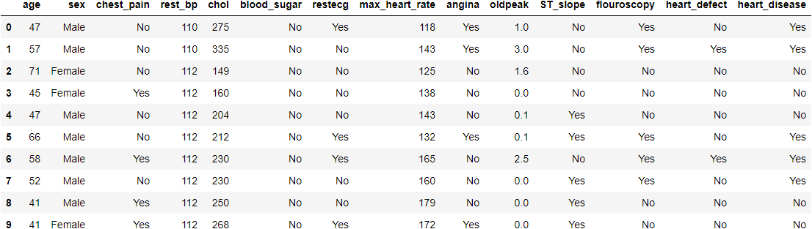

# heart-disease-prediction

A logistic regression model to predict heart disease from 13 features

This model predicts the presence or absence of heart disease based on 13 medical and demographic features. It uses data from https://www.kaggle.com/ronitf/heart-disease-uci, which was published by researchers in de-identified form. There are 296 cases total, of which 136 indicate heart disease.

The notebook was built with Python 3.8.10. The YAML file lists the required packages and may be used to create a conda environment with these packages: see `RUNNING_THE_MODEL` for details.

For questions or comments, please contact me at dvschwab@protonmail.com.

## Summary

The notebook fits 3 versions of a logistic regression model:
> * a full model with all cases and features
> * a reduced model containing only the 9 features with the greatest predictive value
> * a reduced model with 20 outliers trimmed.

All perform well, with a median accuracy of 83% for the test data. None of the models are prone to false positives, although each is slightly better at predicting the absence of heart disease than its presence. However, the cross-validation scores show sample dependence for each model, as shown below for the reduced model:

>> Cross-Validation (5 splits)  
>> Test Accuracy: [0.75, 0.83, 0.90, 0.90, 0.86]  
>> Test MSE:      [0.25, 0.17, 0.10, 0.10, 0.14]

All results are for the test data; *accuracy* is the mean accuracy for both targets, while *MSE* is the mean-squared error. Each split contained 59 or 60 cases. The sample dependence is clear from the first, third, and fourth splits.

The relatively small number of cases per model feature is another limitation. For the reduced model containing 9 features and using a 30/70 test-train split, this amounts to 89 cases / 9 features = 10 cases per feature (standard rounding). Most researchers consider this the minimum ratio of cases-to-feature, as the coefficient standard errors will likely be too large to evaluate the relative importance of each feature.

## Feature Descriptions

These are the demographic and continuous features used in the model:

> * age: age of subject
> * sex: sex of subject (Male/Female)
> * max_heart_rate: maximum heart rate
> * rest_bp: resting blood pressure
> * chol: serum cholestoral (mg/dl)
> * oldpeak: ST depression from exercise

These are the categorical features. Each one indicates the presence of the named indicator, except for *flouroscopy*, which indicates how many major vessels were colored by a specific flouroscopic test (Zero or Nonzero). In all cases, Yes indicates an abnormal condition while No indicates normal functioning.

Note that some of these features were recoded as binary with different levels of the indicator collapsed as *True*. The notebook contains a complete description of the original variables and the recoding applied. Also, the notebook codes each feature as 0/1 rather than as text, which is used here to make the data more understandable.

> * chest_pain: chest pain (Yes/No)
> * blood_sugar: fasting blood sugar > 120 mg/dl (Yes/No)
> * restecg: abnormality (Yes/No)
> * angina: exercise-induced angina (Yes/No)
> * ST_slope: abnormal ST slope (Yes/No)
> * flouroscopy: number of vessels colored by flouroscopy (Zero/Nonzero)
> * heart_defect: heart defect (Yes/No)

The target variable, *heart_disease*, is coded *Yes* or *No*.

# Representative Data Sample

This is a representative sample of 10 cases from the data frame used to fit the model.

